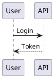

# DocViz Builder

*Este documento en español: [README.md](./README.md)*

Compiles declarative diagram blocks written **inside Markdown** and returns
**standard, portable Markdown**: the final viewer does not need to know about
PlantUML, Mermaid, D2, Vega-Lite, Graphviz or LikeC4 — only how to show an
image.

````md
## Authentication flow


````

becomes

```md
## Authentication flow


```

Everything happens **locally**: no external services, no keys, and no
confidential documentation leaving the machine.

---

## Why

AI agents write documentation with embedded diagrams, but every viewer supports
a different subset: GitHub renders Mermaid but not D2, a corporate portal
probably renders neither, and a PDF renders nothing. The documentation ends up
depending on where it is read.

And forcing an agent to master six syntaxes produces errors: it writes PlantUML
where D2 was needed, or invents a directive that does not exist. The high-level
DSL (`diagram`, `chart`, `architecture`) moves that decision to the compiler.

---

## Install

```bash
npm install -D docviz-builder
npx docviz setup    # downloads plantuml.jar from Maven Central
npx docviz init     # config, AGENTS.md, docs-src/ and a sample
npx docviz doctor   # which engines this machine can use
```

`docviz setup` is the only operation that touches the network, and only once. It
deliberately does **not** run on `postinstall`: a tool meant for confidential
documentation does not download anything on its own without being asked.

| Requirement | What for | Required |
|---|---|---|
| Node.js ≥ 20.11 | Everything | Yes |
| Java ≥ 8 | PlantUML | Only for those types |
| An already-installed Chrome or Chromium | Mermaid and BPMN | Only for those types |

D2, Graphviz, Vega-Lite, LikeC4 and svgbob need nothing else: they ship as
WebAssembly or plain JavaScript. Most types declare a fallback engine, so a
machine without a browser or without Java still compiles what it can instead of
failing whole: **without Java only 4 of 57 types are lost.**

DocViz **never downloads browsers**. It uses the system Chrome, or whatever
Chromium Playwright or Puppeteer already cached. If it finds none, it says so
and explains how to point at one.

---

## Commands

| Command | What it does |
|---|---|
| `docviz build` | Compiles the documents and generates the assets |
| `docviz check` | Validates the blocks without drawing (fast) |
| `docviz diff` | Compares the diagrams of two versions of the documentation |
| `docviz fix` | Fixes the typos of a block that does not compile |
| `docviz verify` | Checks the result has no broken images |
| `docviz preview` | Serves the result in a local viewer, with `--watch` |
| `docviz types` | Lists the DSL types and the themes |
| `docviz suggest "..."` | Recommends a type from a sentence |
| `docviz setup` | Downloads `plantuml.jar` inside the package |
| `docviz skill` | Installs the DocViz contract as a skill for your agent |
| `docviz doctor` | Checks the environment and which types can be drawn |

---

## While you write

```bash
docviz preview docs --watch
```

Compiles, serves the result on `http://127.0.0.1:4321` and keeps watching
`docs-src`. On save it recompiles — only what changed, thanks to the cache — and
**the browser reloads itself**. `docviz build --watch` does the same without a
server, for when you already have your own viewer open.

In watch mode an error does not bring the process down: it is reported and the
watcher keeps waiting for the next save, which is the only sensible behaviour
while you are halfway through writing a block.

Without `--watch` the served page is plain HTML with nothing injected: a preview
has to be saveable and openable on its own.

---

## The high-level DSL

Three fences. You declare the intent; DocViz decides the engine.

| Fence | When |
|---|---|
| `diagram` | Interaction, flow, states, dependencies, strategic analysis |
| `chart` | Quantitative comparison, trend, distribution |
| `architecture` | C4 model |

````md
```diagram
type: sequence
title: Authentication

participants:
  - User
  - API

flow:
  - User -> API: Login
  - API --> User: Token
```
````

The catalog covers 57 types. Consult it from the terminal instead of
remembering it:

```bash
npx docviz suggest "the approval process for a request"
npx docviz types --lang en
npx docviz types sequence --lang en
```

<!-- docviz:tipos-tablas-3-en -->
### Diagrams — `diagram` block

| What you need | `type` | Engine |
|---|---|---|
| Who talks to whom, and in what order | `sequence` | plantuml (or d2) |
| Classes or entities and how they relate | `class` | plantuml (or d2) |
| The states of one thing and the transitions between them | `state` | plantuml (or d2) |
| A process with decisions and parallel branches | `activity` | plantuml (or d2) |
| Data entities, their fields and their cardinality | `erd` | plantuml (or mermaid) |
| What each actor can do with the system | `use-case` | plantuml (or d2) |
| Software components, grouped, and how they connect | `component` | plantuml (or d2) |
| Where each piece runs and on what infrastructure | `deployment` | plantuml (or d2) |
| A sketch of a screen: fields, buttons and layout | `wireframe` | plantuml |
| The shape of a JSON drawn as a tree | `json` | plantuml |
| The shape of a YAML drawn as a tree | `yaml` | plantuml |
| The hierarchical breakdown of a project | `wbs` | plantuml (or d2) |
| A simple end-to-end flow | `flow` | mermaid (or d2) |
| Tasks placed on the calendar | `gantt` | mermaid (or plantuml) |
| A person walking through a process, with how they feel at each step | `journey` | mermaid (or d2) |
| The history of branches, commits and merges | `git-graph` | mermaid |
| Cards spread across status columns | `kanban` | mermaid (or d2) |
| Items placed on two continuous axes | `quadrant` | mermaid (or vega-lite) |
| How a quantity splits as it moves from one state to another | `sankey` | mermaid |
| The composition of a total by proportional area | `treemap` | mermaid |
| A profile across several dimensions at once | `radar` | mermaid |
| Exploring a topic in free branches | `mindmap` | mermaid (or plantuml) |
| Blocks laid out on a grid, with no flow semantics | `block` | mermaid (or d2) |
| Breaking an objective down into lines of action | `strategy-tree` | d2 |
| Breaking a problem down into its causes | `issue-tree` | d2 |
| The alternatives of a decision and where each one leads | `decision-tree` | d2 |
| The pillars holding up an objective, with their content | `strategy-pillars` | d2 |
| Capabilities grouped by domain | `capability-map` | d2 |
| The layers of an operating model, from business to infrastructure | `operating-model` | d2 |
| Chained stages that create value | `value-chain` | d2 |
| A comparison of two scenarios | `before-after` | d2 |
| Four quadrants with their content, without coordinates | `matrix-2x2` | d2 |
| Milestones in chronological order | `timeline` | d2 (or mermaid) |
| Upcoming phases with their content | `roadmap` | d2 |
| Who depends on whom | `dependency-map` | graphviz |
| A business process in standard BPMN notation | `bpmn` | bpmn |
| A drawing made of characters, turned into clean SVG | `ascii` | svgbob |

### Charts — `chart` block

| What you need | `type` | Engine |
|---|---|---|
| A comparison between categories | `bar` | vega-lite |
| A comparison between categories with long labels | `horizontal-bar` | vega-lite |
| The composition of a total, per category | `stacked-bar` | vega-lite |
| A comparison of several series per category | `grouped-bar` | vega-lite |
| How a magnitude evolves over time | `line` | vega-lite |
| Evolution with the accumulated volume emphasised | `area` | vega-lite |
| How the composition of a total evolves | `stacked-area` | vega-lite |
| The relationship between two magnitudes | `scatter` | vega-lite |
| The density of a magnitude across two categorical dimensions | `heatmap` | vega-lite |
| The distribution of a continuous variable | `histogram` | vega-lite |
| Median, spread and outliers per group | `box-plot` | vega-lite |
| The actual value against its target | `bullet` | vega-lite |
| The change between two moments, item by item | `slope` | vega-lite |
| How volume drops along successive stages | `funnel` | vega-lite |
| How a total splits between a few parts | `pie` | vega-lite |
| How a total splits, with the centre free for a figure or a title | `donut` | vega-lite |
| How you get from a starting value to a final one, step by step | `waterfall` | vega-lite |

### Architecture — `architecture` block

| What you need | `type` | Engine |
|---|---|---|
| The system, its users and the systems it talks to | `c4-context` | likec4 (or plantuml-c4) |
| The deployable pieces of the system and their technology | `c4-container` | likec4 (or plantuml-c4) |
| The internal components of one container | `c4-component` | likec4 (or plantuml-c4) |
<!-- /docviz:tipos-tablas-3-en -->

Native fences (`plantuml`, `mermaid`, `d2`, `graphviz`, `vega-lite`, `likec4`)
remain available as an escape hatch.

---

## What changed between two versions

A `.md` diff tells you a YAML block was touched, but not whether the resulting
drawing is different. `docviz diff` compares two document trees and answers in
terms of diagrams:

```bash
docviz diff ./docs-src-previous ./docs-src
```

What it compares is the **effective content** — engine plus compiled source —
not the generated asset. So changing the theme is not a diagram change, nor is
updating an engine, and inserting a paragraph does not turn the diagrams below
it into new ones: identity is `file + title`, not the line.

`--json` returns the full structure and `--exit-code` exits 1 when something
changed, like `git diff`.

---

## Errors

A render failure **never** silently produces an incorrect document: the build
exits non-zero and reports where the problem is.

```
ERROR
codigo: DV101
archivo: docs-src/login.md
linea: 5
motivo: diagram.participants debe ser una lista con al menos un elemento
detalle:
  valor recibido: undefined
  campos no reconocidos:
    - el campo "particpants" no existe en el tipo sequence; quiza querias "participants"
  campos del ejemplo de sequence: flow, participants, title, type
  ficha completa: docviz types sequence
```

Every error carries a **stable code** (`DV001`–`DV007` for environment and
engines, `DV100`–`DV106` for the DSL). The usual reader of the report is an
agent retrying, and deciding the fix by parsing a human-readable sentence is
fragile: the wording can improve, the code cannot.

A document with several broken blocks reports them **all at once**, each with
its line. And `docviz fix` returns the block corrected when the typo is
unambiguous, without guessing and preserving your comments and indentation.

Fields the type does not use are detected even inside nested maps, and reported
as warnings when the block compiles: writing `steps:` where the type expects
`flow:` breaks nothing — it just silently drops the content, which is worse.

---

## Caching and determinism

Every asset is named `<slug>-<hash>.<ext>`, where the hash is

```
SHA256(type + source + theme + theme fingerprint + engine version + format)
```

So an unchanged diagram is never re-rendered, changing a theme colour
invalidates only what it affects, and two documents with the same diagram share
one file. **The same document, the same version and the same theme produce the
same bytes** — and a test renders all 57 types twice to prove it.

---

## Security

1. Local engines by default; no network request during the build.
2. `kroki.io` blocked unless explicitly authorised.
3. A time and a size limit per diagram.
4. PlantUML's `!include`, `!includeurl`, `!import` and `!theme … from` disabled:
   they are arbitrary disk reads and SSRF.
5. Vega-Lite's `data.url` rejected at any depth.
6. Every write path is contained inside the output directory, and the preview
   server resolves symlinks before serving.
7. No document content is ever used as a path or passed to a shell: engines are
   invoked with an argument array, never a string.
8. CI audits the production dependency tree on every commit and fails from
   moderate severity upwards.

**The SVG that leaves here is inert.** Via `` the browser loads it as an
image and executes nothing, but the moment someone inlines it into HTML the SVG
becomes live markup. So every SVG is sanitised with an **allow-list** — 49
elements and 104 attributes, measured against what the six engines actually emit
across the 57 types. A bank of 23 known vectors is part of the test suite.

Mermaid and BPMN draw inside a local Chromium **with the sandbox on**; it is
only disabled as root, where Chromium refuses to start otherwise.

---

## For agents

```bash
npx docviz skill --lang en    # installs this contract into your agent's skills directory
```

DocViz ships an MCP server (`docviz_types`, `docviz_suggest`,
`docviz_validate_document`, `docviz_render_diagram`, `docviz_build_document`,
`docviz_diff`, `docviz_fix`, `docviz_preview`), a queryable catalog, stable
error codes, and `AGENTS.en.md` — a contract whose type tables are generated
from the catalog, so they cannot drift.

### How we know a model can use it

It is measured, not assumed. `eval/casos.json` holds 67 needs written the way a
person would write them — without naming the type — in Spanish and English.

```bash
npm run eval            # no network, no cost: measures whether the catalog guides well
npm run eval:modelo     # the real measurement, with an actual model
```

Current figure on the held-out split: **88.0 %** correct on the first
suggestion, **92.0 %** within the top three.

---

## Compatibility

DocViz is `0.x`. [COMPATIBILIDAD.md](./COMPATIBILIDAD.md) describes what counts
as public contract — the DSL, the error codes, the MCP tool names, the commands
and the output format — and what is internal detail that may change. Pin the
version until 1.0.

---

## License

MIT. See [LICENSE](./LICENSE).
