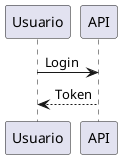

# DocViz Builder

Compila bloques declarativos de diagramas escritos dentro de Markdown y devuelve
**Markdown estándar y portable**: el visor final no necesita conocer PlantUML,
Mermaid, D2, Vega-Lite, Graphviz ni LikeC4, solo saber mostrar una imagen.

```md
## Flujo de autenticación


```

se convierte en

```md
## Flujo de autenticación


```

Todo ocurre **en local**: sin servicios externos, sin claves y sin enviar
documentación confidencial a ningún sitio.

---

## Índice

- [Instalación](#instalación)
- [Uso](#uso)
- [El DSL de alto nivel](#el-dsl-de-alto-nivel)
- [Lenguajes nativos](#lenguajes-nativos)
- [Configuración](#configuración)
- [Temas](#temas)
- [Caché y determinismo](#caché-y-determinismo)
- [Qué cambió entre dos versiones](#qué-cambió-entre-dos-versiones)
- [Errores](#errores)
- [Seguridad](#seguridad)
- [Servidor MCP](#servidor-mcp)
- [Que tu agente sepa que existe](#que-tu-agente-sepa-que-existe)
- [Cómo sabemos que un modelo lo sabe usar](#cómo-sabemos-que-un-modelo-lo-sabe-usar)
- [Desarrollo](#desarrollo)

---

## Instalación

Requisitos:

| Requisito | Para qué | Obligatorio |
|---|---|---|
| Node.js ≥ 20.11 | Todo | Sí |
| Java ≥ 8 | PlantUML (UML, ERD, C4 alternativo, wireframes) | Solo si usas esos tipos |
| Chrome o Chromium ya instalado | Mermaid y BPMN | Solo si usas esos tipos |

D2, Graphviz, Vega-Lite, LikeC4 y svgbob no necesitan nada más: van embebidos
como WebAssembly o JavaScript puro.

Varios tipos declaran un motor alternativo, así que una máquina sin navegador o
sin Java sigue compilando lo que pueda en lugar de fallar entera.

### En tu proyecto

```bash
npm install -D docviz-builder
npx docviz setup    # descarga plantuml.jar desde Maven Central
npx docviz init     # docviz.config.yaml, AGENTS.md, docs-src/ y un ejemplo
npx docviz doctor   # qué motores puede usar esta máquina
```

`docviz setup` es la única operación que usa la red, y solo una vez. No se
ejecuta en el `postinstall` a propósito: una herramienta pensada para
documentación confidencial no descarga nada por su cuenta sin que se lo pidas.
Si tu organización ya distribuye el jar, apúntalo con `renderers.plantuml.jar`
en la configuración y omite ese paso.

### Desde el repositorio

```bash
git clone https://github.com/TilsonF/docviz-builder.git
cd docviz-builder
npm install
npm run setup
npm run build
```

DocViz **no descarga navegadores**. Usa el Chrome del sistema o el Chromium que
ya tengan cacheado Playwright o Puppeteer. Si no encuentra ninguno, lo dice y
explica cómo indicárselo.

---

## Uso

```bash
docviz build <source> --output <target>
```

| Comando | Qué hace |
|---|---|
| `docviz build` | Compila los documentos y genera los recursos |
| `docviz check` | Valida los bloques sin renderizar (rápido) |
| `docviz diff` | Compara los diagramas de dos versiones de la documentación |
| `docviz fix` | Corrige las erratas de un bloque que no compila |
| `docviz verify` | Comprueba que el resultado no tenga imágenes rotas |
| `docviz preview` | Sirve el resultado en un visor local |
| `docviz types` | Lista los tipos del DSL y los temas |
| `docviz setup` | Descarga `plantuml.jar` dentro del paquete |
| `docviz skill` | Instala el contrato de DocViz como skill de tu agente |
| `docviz suggest "..."` | Recomienda un tipo a partir de una frase |
| `npm run docs:sync` | Regenera las tablas de tipos de la documentación |
| `npm run check:github` | Comprueba cómo renderizaría GitHub la salida |

Opciones de `build`:

```bash
docviz build ./docs-src \
  --output ./docs \
  --theme corporate \
  --clean \
  --verbose \
  --no-cache \
  --renderer-url http://localhost:8000 \
  --continue-on-error
```

Flujo recomendado, ya cableado como scripts de npm:

```bash
npm run docs:check     # ¿la documentación está al día y los bloques son válidos?
npm run docs:build     # docs-src/ -> docs/
npm run docs:test      # verifica la salida y corre las pruebas de integración
npm run docs:preview   # revisión visual en el navegador
```

`docs:check` y `docs:build` terminan con código distinto de cero si algo falla,
así que encajan directamente en un pipeline de CI.

### La documentación no puede desfasarse

Las tablas de tipos de este README, de `AGENTS.md` y de `docs-src/dsl.md` se
generan desde el catálogo entre marcas `<!-- docviz:... -->`. `docs:check`
verifica que estén al día y falla si no lo están, así que un tipo nuevo no puede
publicarse con la documentación vieja. Para regenerarlas:

```bash
npm run docs:sync
```

### Cómo se verá en GitHub

```bash
npm run check:github
```

Pide a GitHub que renderice el Markdown compilado con su propia API y comprueba
sobre el HTML resultante que cada imagen aparece, conserva su texto alternativo
y sigue apuntando a una ruta relativa. No necesita publicar el repositorio.

---

## El DSL de alto nivel

Un autor —humano o agente— no debería memorizar seis sintaxis. DocViz ofrece
tres vallas y elige el motor por ti:

| Valla | Para qué |
|---|---|
| `diagram` | Interacción, flujo, estados, dependencias, análisis estratégico |
| `chart` | Comparación cuantitativa, tendencia, distribución |
| `architecture` | Modelo C4 |

````md
```diagram
type: sequence
title: Autenticación de usuario

participants:
  - Usuario
  - Frontend
  - Entra ID
  - API

flow:
  - Usuario -> Frontend: Login
  - Frontend -> Entra ID: Authenticate
  - Entra ID --> Frontend: Token
  - Frontend -> API: Request + Token
```
````

````md
```chart
type: bar
title: Defectos por sprint

data:
  - label: SP1
    value: 42
  - label: SP2
    value: 28
  - label: SP3
    value: 15
```
````

````md
```architecture
type: c4-context
title: Contexto

elements:
  - id: usuario
    kind: person
    name: Usuario
  - id: core
    kind: system
    name: Plataforma

relations:
  - from: usuario
    to: core
    label: Utiliza
```
````

El catálogo cubre <!-- docviz:tipos-total -->57<!-- /docviz:tipos-total --> tipos.
`docviz types` los lista siempre actualizados, con su propósito y un ejemplo;
`docviz suggest` recomienda uno a partir de una frase.

<!-- docviz:tipos-resumen -->
| Motor | Tipos |
|---|---|
| vega-lite | 17 |
| plantuml | 12 |
| d2 | 11 |
| mermaid | 11 |
| likec4 | 3 |
| bpmn | 1 |
| graphviz | 1 |
| svgbob | 1 |
<!-- /docviz:tipos-resumen -->

<!-- docviz:tipos-tablas-4 -->
#### Diagramas — bloque `diagram`

| Necesidad | `type` | Motor |
|---|---|---|
| Quien habla con quien y en que orden | `sequence` | plantuml (o d2) |
| Estructura de clases o entidades y sus relaciones | `class` | plantuml (o d2) |
| Estados de una entidad y las transiciones entre ellos | `state` | plantuml (o d2) |
| Proceso con decisiones y ramas paralelas | `activity` | plantuml |
| Entidades de datos, sus campos y su cardinalidad | `erd` | plantuml (o mermaid) |
| Que puede hacer cada actor con el sistema | `use-case` | plantuml (o d2) |
| Componentes de software agrupados y como se conectan | `component` | plantuml (o d2) |
| Donde se ejecuta cada pieza y sobre que infraestructura | `deployment` | plantuml (o d2) |
| Boceto de una pantalla: campos, botones y disposicion | `wireframe` | plantuml |
| Estructura de un JSON dibujada como arbol | `json` | plantuml |
| Estructura de un YAML dibujada como arbol | `yaml` | plantuml |
| Descomposicion jerarquica del trabajo de un proyecto | `wbs` | plantuml (o d2) |
| Flujo sencillo de extremo a extremo | `flow` | mermaid (o d2) |
| Tareas situadas en el calendario | `gantt` | mermaid (o plantuml) |
| Recorrido de una persona por un proceso, con su nivel de satisfaccion | `journey` | mermaid |
| Historia de ramas, commits y fusiones | `git-graph` | mermaid |
| Tarjetas repartidas por columna de estado | `kanban` | mermaid |
| Elementos situados en dos ejes continuos | `quadrant` | mermaid |
| Como se reparte una cantidad al pasar de un estado a otro | `sankey` | mermaid |
| Composicion de un total por area proporcional | `treemap` | mermaid |
| Perfil de varias dimensiones a la vez | `radar` | mermaid |
| Exploracion de un tema en ramas libres | `mindmap` | mermaid (o plantuml) |
| Bloques dispuestos en rejilla, sin semantica de flujo | `block` | mermaid |
| Descomposicion de un objetivo en lineas de accion | `strategy-tree` | d2 |
| Descomposicion de un problema en sus causas | `issue-tree` | d2 |
| Alternativas de una decision y sus ramas | `decision-tree` | d2 |
| Pilares que sostienen un objetivo, con su contenido | `strategy-pillars` | d2 |
| Capacidades agrupadas por dominio | `capability-map` | d2 |
| Capas de un modelo operativo, de negocio a infraestructura | `operating-model` | d2 |
| Etapas encadenadas que generan valor | `value-chain` | d2 |
| Comparacion de dos escenarios | `before-after` | d2 |
| Cuatro cuadrantes con su contenido, sin coordenadas | `matrix-2x2` | d2 |
| Hitos en orden cronologico | `timeline` | d2 (o mermaid) |
| Fases futuras con su contenido | `roadmap` | d2 |
| Quien depende de quien | `dependency-map` | graphviz |
| Proceso de negocio en notacion BPMN estandar | `bpmn` | bpmn |
| Dibujo hecho con caracteres, convertido a SVG limpio | `ascii` | svgbob |

#### Gráficos — bloque `chart`

| Necesidad | `type` | Motor |
|---|---|---|
| Comparacion entre categorias | `bar` | vega-lite |
| Comparacion entre categorias con etiquetas largas | `horizontal-bar` | vega-lite |
| Composicion de un total por categoria | `stacked-bar` | vega-lite |
| Comparacion de varias series por categoria | `grouped-bar` | vega-lite |
| Evolucion de una magnitud en el tiempo | `line` | vega-lite |
| Evolucion con enfasis en el volumen acumulado | `area` | vega-lite |
| Evolucion de la composicion de un total | `stacked-area` | vega-lite |
| Relacion entre dos magnitudes | `scatter` | vega-lite |
| Densidad de una magnitud en dos dimensiones categoricas | `heatmap` | vega-lite |
| Distribucion de una variable continua | `histogram` | vega-lite |
| Mediana, dispersion y valores atipicos por grupo | `box-plot` | vega-lite |
| Valor real frente a su objetivo | `bullet` | vega-lite |
| Cambio entre dos momentos, elemento a elemento | `slope` | vega-lite |
| Caida de volumen a lo largo de etapas sucesivas | `funnel` | vega-lite |
| Reparto de un total entre pocas partes | `pie` | vega-lite |
| Reparto de un total, con el centro libre para un dato o un titulo | `donut` | vega-lite |
| Como se llega de un valor inicial a uno final, paso a paso | `waterfall` | vega-lite |

#### Arquitectura — bloque `architecture`

| Necesidad | `type` | Motor |
|---|---|---|
| El sistema, sus usuarios y los sistemas con los que habla | `c4-context` | likec4 (o plantuml-c4) |
| Las piezas desplegables del sistema y su tecnologia | `c4-container` | likec4 (o plantuml-c4) |
| Componentes internos de un contenedor | `c4-component` | likec4 (o plantuml-c4) |
<!-- /docviz:tipos-tablas-4 -->

Cuando un tipo declara un motor alternativo, DocViz lo usa automáticamente si el
preferido no está disponible: así se puede compilar en una máquina sin navegador
o sin Java sin que el build se caiga.

### Sintaxis de las relaciones

```yaml
flow:
  - A -> B: mensaje       # línea sólida
  - A --> B: respuesta    # línea discontinua
  - B <- A: equivale a A -> B
  - from: A               # forma explícita
    to: B
    label: mensaje
```

---

## Lenguajes nativos

Los seis lenguajes siguen disponibles como vía de escape:

| Valla | Alias | Motor |
|---|---|---|
| `plantuml` | `puml`, `uml` | PlantUML local (JVM) |
| `mermaid` | `mmd` | Mermaid en Chromium headless |
| `d2` | — | D2 WebAssembly |
| `graphviz` | `dot` | Graphviz WebAssembly |
| `vega-lite` | `vegalite`, `vl` | Vega-Lite + Vega en proceso |
| `likec4` | `c4` | LikeC4 + emisor SVG propio |
| `svgbob` | `ascii-art` | svgbob WebAssembly (arte ASCII) |
| `bpmn` | — | bpmn-js en Chromium headless |

PlantUML incluye su biblioteca estándar dentro del jar, así que `!include <C4/C4_Context>`
y el resto de bibliotecas empaquetadas funcionan sin red. Cualquier otra forma
de `!include` sigue bloqueada.

Cualquier otro lenguaje (`typescript`, `bash`, `json`, vallas sin lenguaje) se
deja intacto.

### Opciones en la valla

````md
```plantuml title="Flujo de autenticación" format=png
````

| Opción | Efecto |
|---|---|
| `title="..."` (o `alt="..."`) | Texto alternativo y nombre del archivo |
| `format=svg\|png` | Formato de salida de ese bloque |

Sin `title`, DocViz usa el campo `title:` del DSL o el encabezado anterior.

---

## Configuración

`docviz.config.yaml`, todo opcional:

```yaml
source: docs-src

output:
  dir: docs
  assetsDir: assets/generated

theme:
  name: corporate

formats:
  plantuml: svg
  mermaid: svg
  d2: svg
  graphviz: svg
  vega-lite: svg
  likec4: svg

cache:
  enabled: true
  dir: .docviz-cache

hash:
  length: 12

renderers:
  backend: local          # local | kroki
  timeoutMs: 60000
  maxOutputBytes: 8388608

  kroki:
    url: http://localhost:8000
    allowPublicService: false
    allowRemoteHost: false

  plantuml:
    jar: vendor/plantuml.jar
    java: java
    maxHeap: 1024m

  mermaid:
    browserPath: /Applications/Google Chrome.app/Contents/MacOS/Google Chrome

  d2:
    layout: dagre         # dagre | elk

  graphviz:
    engine: dot
```

### Kroki self-hosted

Si prefieres centralizar el render en una instancia propia:

```yaml
renderers:
  backend: kroki
  kroki:
    url: http://kroki.interno:8000
    allowRemoteHost: true
```

LikeC4 no pasa por Kroki: siempre usa el renderer especializado.

---

## Temas

`default`, `corporate`, `executive` y `dark`. Un tema define la misma identidad
visual en el dialecto de cada motor —`skinparam` de PlantUML, `themeVariables`
de Mermaid, `themeID` de D2, atributos de Graphviz, `config` de Vega-Lite y la
paleta del emisor de LikeC4— para que diagramas de motores distintos parezcan
del mismo documento.

```bash
docviz build docs-src --output docs --theme executive
```

### Una imagen, dos modos

Los tres temas claros declaran además su contraparte oscura, y el SVG generado
lleva las dos: los colores se emiten como variables CSS que se redefinen bajo
`@media (prefers-color-scheme: dark)`.

Un SVG referenciado desde `` se renderiza como su propio documento, así que
el navegador le aplica la preferencia del lector. El resultado es **un solo
archivo** que se lee bien en GitHub en modo claro y en un portal en modo oscuro,
sin duplicar recursos ni escribir `<picture>` a mano.

| Motor | Cómo obtiene su variante oscura |
|---|---|
| PlantUML, Mermaid, Graphviz, Vega-Lite | Los colores del tema se reescriben como variables CSS |
| LikeC4 | El emisor propio calcula cada color con las dos paletas |
| D2 | Trae su propio par de temas (`themeID` / `darkThemeID`) |

El tema `dark` es de un solo modo: quien lo elige quiere oscuro siempre.

---

## Caché y determinismo

El nombre de cada recurso es `<slug>-<hash>.<ext>`, donde el hash es

```
SHA256(tipo + fuente + tema + huella del tema + versión del motor + formato)
```

truncado a 12 caracteres (configurable entre 8 y 16). En consecuencia:

- un diagrama sin cambios nunca se vuelve a renderizar;
- cambiar un color del tema invalida solo lo afectado;
- actualizar PlantUML invalida solo los diagramas de PlantUML;
- dos documentos con el mismo diagrama comparten un único archivo.

El truncado es seguro porque el build detecta colisiones: si dos fuentes
distintas comparten prefijo, aborta en lugar de sobrescribir.

```bash
docviz build docs-src --output docs   # 12 regenerados, 0 cache hits
docviz build docs-src --output docs   # 0 regenerados, 12 cache hits
```

El caché vive fuera del directorio de salida, así que `--clean` borra la salida
sin perder los aciertos.

---

## Qué cambió entre dos versiones

El diff de un `.md` dice que se tocó un bloque YAML, pero no si el dibujo
resultante es distinto. `docviz diff` compara dos árboles de documentos y
responde en términos de diagramas:

```bash
docviz diff ./docs-src-anterior ./docs-src
```

```
base: docs-src-anterior
head: docs-src

  ~ arquitectura.md:12  "Autenticación"  (diagram, plantuml)
  + arquitectura.md:96  "Métricas"       (chart, vega-lite)
  - antiguo.md:5        "Modelo viejo"   (diagram, d2)

resumen: 1 nuevo(s), 1 eliminado(s), 1 modificado(s), 12 igual(es)
```

Lo que se compara es el **contenido efectivo** —motor más fuente compilada—, no
el recurso generado. En consecuencia:

- cambiar de tema no aparece como cambio de diagrama;
- actualizar la versión de un motor tampoco;
- reordenar el YAML sin alterar el resultado tampoco;
- insertar un párrafo delante no convierte en nuevos a los diagramas que
  quedaron desplazados: la identidad es `archivo + título`, no la línea.

No renderiza nada, así que es tan rápido como `check`. Un lado inválido no
aborta la comparación —la versión antigua puede estar rota y aun así interesa
saber qué cambió— pero sus bloques se reportan como aviso.

Opciones: `--all` incluye también los diagramas que no cambiaron, `--json`
devuelve la estructura completa y `--exit-code` termina con código 1 si algo
cambió, igual que `git diff`. En un pipeline:

```bash
git worktree add /tmp/base origin/main
docviz diff /tmp/base/docs-src ./docs-src --exit-code || echo "revisar los diagramas"
```

---

## Errores

Un fallo de render **nunca** produce un documento incorrecto en silencio: el
build termina con código distinto de cero y reporta dónde está el problema.

```
ERROR
codigo: DV002
archivo: docs-src/arquitectura.md
linea: 74
renderer: plantuml
motivo: Syntax Error? (Assumed diagram type: sequence)
detalle:
  ERROR
  2
  Syntax Error?
```

`--continue-on-error` compila el resto y deja intacto el bloque que falló, para
que el documento no mienta sobre lo que contiene. No es el comportamiento por
defecto.

### El código de regla

Todo error lleva un código estable. El destinatario habitual del reporte es un
agente reintentando, y decidir la corrección analizando un mensaje escrito en
castellano es frágil: la redacción puede cambiar, el código no.

| Código | Qué pasó |
|---|---|
| `DV001` | El lenguaje de la valla no tiene renderer registrado |
| `DV002` | El motor falló al dibujar |
| `DV003` | Una ruta intentó salirse del directorio de salida |
| `DV004` | Configuración inválida |
| `DV005` | El motor que necesita el tipo no está disponible en esta máquina |
| `DV006` | El renderer no puede producir ese formato |
| `DV007` | Colisión de hash truncado |
| `DV100` | DSL inválido, sin clasificar |
| `DV101` | Falta un campo obligatorio |
| `DV102` | El campo existe pero su valor no tiene la forma esperada |
| `DV103` | El valor no pertenece al conjunto admitido |
| `DV104` | El bloque declara un campo que el tipo no usa |
| `DV105` | El bloque no es YAML válido |
| `DV106` | El `type` no existe o no pertenece a esa valla |

Los códigos son parte del contrato: se añaden códigos nuevos en lugar de
reutilizar los existentes.

### Un bloque roto no esconde a los siguientes

El escaneo no se detiene en el primer error: un documento con tres bloques
inválidos los reporta los tres, cada uno con su línea. Corregirlos de uno en
uno, con un build completo entre cada corrección, es un ciclo caro.

```
documentos: 1
bloques:    1  (2 invalido(s))
avisos:     0
errores:    2
```

### Erratas y campos ignorados

Escribir `steps:` donde el tipo espera `flow:` no rompe nada: simplemente el
contenido no se dibuja. Ese silencio es peor que un error, porque el documento
sale y nadie se entera de que le falta la mitad.

DocViz detecta los campos que el tipo no usa y, si se parecen a uno válido, dice
cuál:

```
ERROR
codigo: DV101
archivo: docs-src/login.md
linea: 5
motivo: diagram.participants debe ser una lista con al menos un elemento
detalle:
  valor recibido: undefined
  campos no reconocidos:
    - el campo "particpants" no existe en el tipo sequence; quiza querias "participants"
    - el campo "steps" no existe en el tipo sequence y se ha ignorado
  campos del ejemplo de sequence: flow, participants, title, type
  ficha completa: docviz types sequence
```

Cuando el bloque **sí** compila, el campo ignorado se reporta como aviso
(`AVISO archivo:linea [DV104] ...`) en stderr y no cambia el código de salida:
el documento es válido, solo incompleto respecto a lo que su autor escribió.

La lista de campos válidos no se mantiene a mano —serían 57 listas que acabarían
divergiendo— sino que se deduce de dos fuentes que ya existen: las claves del
ejemplo canónico del catálogo, que las pruebas de integración dibujan de verdad,
y las claves que el compilador leyó realmente. Un campo que no está en ninguna
de las dos no hizo nada; eso es un hecho, no una heurística.

---

## Seguridad

1. Motores locales por defecto; ninguna petición de red durante el build.
2. `kroki.io` bloqueado salvo autorización explícita.
3. Límite de tiempo y de tamaño por diagrama.
4. `!include`, `!includeurl`, `!import` y `!theme … from` de PlantUML
   deshabilitados: son lectura de disco arbitraria y SSRF.
5. `data.url` de Vega-Lite rechazado a cualquier profundidad.
6. Toda ruta de escritura queda contenida en el directorio de salida, y el
   servidor de previsualización resuelve los enlaces simbólicos antes de servir.
7. Ningún contenido del documento se usa como ruta ni se pasa a un shell: los
   motores se invocan con un array de argumentos, nunca con una cadena.
8. El CI audita el árbol de dependencias de producción en cada commit y falla a
   partir de severidad moderada. Dependabot abre los pull requests de
   actualización sin que nadie tenga que acordarse.

### El SVG que sale de aquí es inerte

Vía `` el navegador carga el SVG como imagen y no ejecuta nada. Pero en
cuanto alguien lo **incrusta dentro de un HTML** —que es lo natural para
conservar el tema claro/oscuro— el SVG pasa a ser markup vivo. Por eso todo SVG
se sanea con una **lista de permitidos**: 49 elementos y 104 atributos medidos
sobre lo que emiten de verdad los seis motores en los 57 tipos del catálogo.

Lo que no está en la lista se cae, incluido lo que no se nos haya ocurrido.
Además se eliminan los comentarios XML, se escapan `<` y `>` dentro de los
valores de atributo, se rechaza cualquier esquema de URL que no sea `http(s)` o
un fragmento interno —resolviendo antes las entidades, porque
`java&#115;cript:` se lee igual que `javascript:`— y el CSS pierde `@import`,
`expression(` y las `url()` ejecutables.

`tests/unit/svg-seguridad.test.ts` mantiene un banco de 23 vectores conocidos y
comprueba, además, que sanear los 69 diagramas del catálogo no quita nada más
que comentarios. La versión anterior del saneador era una lista de prohibidos y
dejaba pasar nueve de esos vectores.

### Chromium con sandbox

Mermaid y BPMN dibujan dentro de un Chromium local, y el contenido del diagrama
puede venir del documento de otra persona. El sandbox **está activo por
defecto**: se desactiva solo como root —donde Chromium no arranca de otra
forma—, o si se pide con `renderers.noSandbox: true` o `DOCVIZ_NO_SANDBOX=1`.
Mermaid además se configura con `securityLevel: 'strict'` y sin etiquetas HTML.

### El único descargable se verifica

`docviz setup` es lo único que trae bytes de fuera. Se comprueba contra un
digest SHA-256 fijado en el repositorio y verificado contra el checksum
publicado en Maven Central; si no coincide, **no se escribe nada**. Para una
versión de PlantUML sin digest conocido hay que pasarlo con `--sha256`, o pedir
explícitamente `--sin-verificar`.

---

## Servidor MCP

DocViz se expone como herramientas MCP para que un agente no tenga que ejecutar
comandos:

| Herramienta | Qué hace |
|---|---|
| `docviz_suggest` | Recomienda el tipo a partir de una frase y devuelve el bloque |
| `docviz_types` | Catálogo de tipos con propósito, cuándo usarlos y ejemplo |
| `docviz_validate_document` | Valida bloques sin renderizar |
| `docviz_render_diagram` | Renderiza un diagrama suelto |
| `docviz_build_document` | Compila y verifica la documentación |
| `docviz_diff` | Qué diagramas cambiaron entre dos versiones |
| `docviz_fix` | Devuelve corregido un bloque que no compila |
| `docviz_preview` | Devuelve el Markdown compilado y sus incidencias |

Registro en un cliente MCP:

```json
{
  "mcpServers": {
    "docviz": {
      "command": "node",
      "args": ["/ruta/a/docviz-builder/bin/docviz-mcp.mjs"],
      "cwd": "/ruta/a/tu/proyecto"
    }
  }
}
```

---

## Que tu agente sepa que existe

`docviz init` deja un `AGENTS.md` en el proyecto, y con eso basta para los
agentes que lo leen solos. Pero un agente solo abre `AGENTS.md` si ya está
trabajando en ese repositorio: no hay forma de que sepa que DocViz existe antes
de eso.

```bash
npx docviz skill              # lo instala en .claude/skills/ del proyecto
npx docviz skill --global     # o en tu perfil, para todos tus proyectos
npx docviz skill --dir .config/opencode/skills   # otro agente
```

El skill es un resumen corto: las tres vallas, cómo preguntar el tipo, el flujo
de trabajo y la tabla de códigos de error. El catálogo completo de los 57 tipos
sigue en `AGENTS.md`, al que el skill apunta.

---

## Cómo sabemos que un modelo lo sabe usar

Que un LLM acierte no es una intuición: se mide. `eval/casos.json` contiene 45
necesidades escritas como las escribiría una persona —sin nombrar el tipo— con
el tipo que debería elegir.

```bash
npm run eval            # sin red y sin coste: mide si el catálogo guía bien
npm run eval:modelo     # la medida real, con un modelo de verdad
```

El **modo catálogo** pregunta a `docviz suggest` qué tipo usaría para cada
necesidad. No usa ningún modelo, pero mide justo lo que un modelo lee para
decidir: los `keywords`, el `purpose` y el `whenToUse`. Es determinista, dura un
segundo y por eso es una compuerta de CI (`npm run eval -- --minimo 0.85`).

El **modo modelo** es la medida real: se le entrega el mismo `AGENTS.md` que
recibiría en un proyecto, se le pide el bloque y se compila. Si falla, se le
devuelve el error tal cual —con su código y su errata señalada— y se le deja
reintentar. Lo que se mide entonces no es solo si acierta, sino si los mensajes
de error le permiten recuperarse. Requiere `ANTHROPIC_API_KEY` y gasta dinero.

Medida actual del modo catálogo: **80,0 %** de acierto en la primera propuesta y
**88,9 %** entre las tres primeras. Los fallos conocidos están en gráficos cuyo
nombre nadie usa al describir la necesidad (`histogram`, `funnel`,
`stacked-bar`, `horizontal-bar`): el término de dominio aparece en el catálogo,
pero lo ahogan las coincidencias de prosa genérica. Es el primer objetivo de
mejora, y hay que hacerlo con una partición de casos aparte para que el número
siga siendo honesto.

---

## Desarrollo

```bash
npm run build          # compila TypeScript
npm run typecheck
npm test               # 752 pruebas
npm run test:unit
npm run test:integration
npx vitest run --coverage
npm run showcase       # compila examples/showcase.md
```

Estructura:

```
src/
├── core/        tipos, registry, hash, caché, rutas, errores
├── config/      carga y validación de docviz.config.yaml
├── markdown/    detección (mdast) y sustitución por posición
├── dsl/         diagram, chart y architecture
├── renderers/   los seis motores + backend Kroki + utilidades SVG
├── themes/      default, corporate, executive, dark
├── build/       orquestador, verificador y servidor de previsualización
├── mcp/         herramientas y servidor MCP
└── cli.ts
```

La cobertura exigida es 90 % de líneas, sentencias y funciones, y 85 % de ramas;
el umbral está configurado en `vitest.config.ts` y falla el build si baja.

Las pruebas de integración **dibujan de verdad el ejemplo de cada tipo del
catálogo** con su motor real. No basta con comprobar que el compilador genera el
texto: varios tipos se apoyan en notaciones que sus motores marcan como beta, y
si una cambia de sintaxis el compilador seguiría produciendo su texto sin
enterarse. Renderizarlos es lo que convierte esa rotura en un fallo inmediato en
lugar de en una sorpresa semanas después.

---

## Licencia

MIT.
