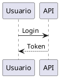

# DocViz Builder

Compila bloques declarativos de diagramas escritos dentro de Markdown y devuelve
**Markdown estándar y portable**: el visor final no necesita conocer PlantUML,
Mermaid, D2, Vega-Lite, Graphviz ni LikeC4, solo saber mostrar una imagen.

```md
## Flujo de autenticación


```

se convierte en

```md
## Flujo de autenticación


```

Todo ocurre **en local**: sin servicios externos, sin claves y sin enviar
documentación confidencial a ningún sitio.

---

## Índice

- [Instalación](#instalación)
- [Uso](#uso)
- [El DSL de alto nivel](#el-dsl-de-alto-nivel)
- [Lenguajes nativos](#lenguajes-nativos)
- [Configuración](#configuración)
- [Temas](#temas)
- [Caché y determinismo](#caché-y-determinismo)
- [Errores](#errores)
- [Seguridad](#seguridad)
- [Servidor MCP](#servidor-mcp)
- [Desarrollo](#desarrollo)

---

## Instalación

Requisitos:

| Requisito | Para qué | Obligatorio |
|---|---|---|
| Node.js ≥ 20.11 | Todo | Sí |
| Java ≥ 8 | PlantUML | Solo si usas UML |
| Chrome o Chromium ya instalado | Mermaid | Solo si usas Mermaid |

D2, Graphviz, Vega-Lite y LikeC4 no necesitan nada más: van embebidos como
WebAssembly o JavaScript puro.

```bash
npm install
npm run setup      # descarga vendor/plantuml.jar desde Maven Central
npm run build
```

`npm run setup` es la única operación que usa la red, y solo una vez. Si tu
organización ya distribuye el jar, apúntalo con `renderers.plantuml.jar` en la
configuración y omite este paso.

DocViz **no descarga navegadores**. Usa el Chrome del sistema o el Chromium que
ya tengan cacheado Playwright o Puppeteer. Si no encuentra ninguno, lo dice y
explica cómo indicárselo.

---

## Uso

```bash
docviz build <source> --output <target>
```

| Comando | Qué hace |
|---|---|
| `docviz build` | Compila los documentos y genera los recursos |
| `docviz check` | Valida los bloques sin renderizar (rápido) |
| `docviz verify` | Comprueba que el resultado no tenga imágenes rotas |
| `docviz preview` | Sirve el resultado en un visor local |
| `docviz types` | Lista los tipos del DSL y los temas |

Opciones de `build`:

```bash
docviz build ./docs-src \
  --output ./docs \
  --theme corporate \
  --clean \
  --verbose \
  --no-cache \
  --renderer-url http://localhost:8000 \
  --continue-on-error
```

Flujo recomendado, ya cableado como scripts de npm:

```bash
npm run docs:check     # ¿los bloques son interpretables?
npm run docs:build     # docs-src/ -> docs/
npm run docs:test      # verifica la salida y corre las pruebas de integración
npm run docs:preview   # revisión visual en el navegador
```

`docs:check` y `docs:build` terminan con código distinto de cero si algo falla,
así que encajan directamente en un pipeline de CI.

---

## El DSL de alto nivel

Un autor —humano o agente— no debería memorizar seis sintaxis. DocViz ofrece
tres vallas y elige el motor por ti:

| Valla | Para qué |
|---|---|
| `diagram` | Interacción, flujo, estados, dependencias, análisis estratégico |
| `chart` | Comparación cuantitativa, tendencia, distribución |
| `architecture` | Modelo C4 |

````md
```diagram
type: sequence
title: Autenticación de usuario

participants:
  - Usuario
  - Frontend
  - Entra ID
  - API

flow:
  - Usuario -> Frontend: Login
  - Frontend -> Entra ID: Authenticate
  - Entra ID --> Frontend: Token
  - Frontend -> API: Request + Token
```
````

````md
```chart
type: bar
title: Defectos por sprint

data:
  - label: SP1
    value: 42
  - label: SP2
    value: 28
  - label: SP3
    value: 15
```
````

````md
```architecture
type: c4-context
title: Contexto

elements:
  - id: usuario
    kind: person
    name: Usuario
  - id: core
    kind: system
    name: Plataforma

relations:
  - from: usuario
    to: core
    label: Utiliza
```
````

Tipos disponibles (`docviz types` los lista siempre actualizados):

| Valla | Tipos | Motor |
|---|---|---|
| `diagram` | `sequence`, `class`, `state`, `activity` | PlantUML |
| `diagram` | `flow`, `gantt` | Mermaid |
| `diagram` | `strategy-tree`, `issue-tree`, `decision-tree`, `strategy-pillars`, `capability-map`, `operating-model`, `value-chain`, `before-after`, `matrix-2x2`, `timeline`, `roadmap` | D2 |
| `diagram` | `dependency-map` | Graphviz |
| `chart` | `bar`, `column`, `horizontal-bar`, `stacked-bar`, `grouped-bar`, `line`, `area`, `scatter`, `heatmap`, `pie`, `donut`, `waterfall` | Vega-Lite |
| `architecture` | `c4-context`, `c4-container`, `c4-component` | LikeC4 |

### Sintaxis de las relaciones

```yaml
flow:
  - A -> B: mensaje       # línea sólida
  - A --> B: respuesta    # línea discontinua
  - B <- A: equivale a A -> B
  - from: A               # forma explícita
    to: B
    label: mensaje
```

---

## Lenguajes nativos

Los seis lenguajes siguen disponibles como vía de escape:

| Valla | Alias | Motor |
|---|---|---|
| `plantuml` | `puml`, `uml` | PlantUML local (JVM) |
| `mermaid` | `mmd` | Mermaid en Chromium headless |
| `d2` | — | D2 WebAssembly |
| `graphviz` | `dot` | Graphviz WebAssembly |
| `vega-lite` | `vegalite`, `vl` | Vega-Lite + Vega en proceso |
| `likec4` | `c4` | LikeC4 + emisor SVG propio |

Cualquier otro lenguaje (`typescript`, `bash`, `json`, vallas sin lenguaje) se
deja intacto.

### Opciones en la valla

````md
```plantuml title="Flujo de autenticación" format=png
````

| Opción | Efecto |
|---|---|
| `title="..."` (o `alt="..."`) | Texto alternativo y nombre del archivo |
| `format=svg\|png` | Formato de salida de ese bloque |

Sin `title`, DocViz usa el campo `title:` del DSL o el encabezado anterior.

---

## Configuración

`docviz.config.yaml`, todo opcional:

```yaml
source: docs-src

output:
  dir: docs
  assetsDir: assets/generated

theme:
  name: corporate

formats:
  plantuml: svg
  mermaid: svg
  d2: svg
  graphviz: svg
  vega-lite: svg
  likec4: svg

cache:
  enabled: true
  dir: .docviz-cache

hash:
  length: 12

renderers:
  backend: local          # local | kroki
  timeoutMs: 60000
  maxOutputBytes: 8388608

  kroki:
    url: http://localhost:8000
    allowPublicService: false
    allowRemoteHost: false

  plantuml:
    jar: vendor/plantuml.jar
    java: java
    maxHeap: 1024m

  mermaid:
    browserPath: /Applications/Google Chrome.app/Contents/MacOS/Google Chrome

  d2:
    layout: dagre         # dagre | elk

  graphviz:
    engine: dot
```

### Kroki self-hosted

Si prefieres centralizar el render en una instancia propia:

```yaml
renderers:
  backend: kroki
  kroki:
    url: http://kroki.interno:8000
    allowRemoteHost: true
```

LikeC4 no pasa por Kroki: siempre usa el renderer especializado.

---

## Temas

`default`, `corporate`, `executive` y `dark`. Un tema define la misma identidad
visual en el dialecto de cada motor —`skinparam` de PlantUML, `themeVariables`
de Mermaid, `themeID` de D2, atributos de Graphviz, `config` de Vega-Lite y la
paleta del emisor de LikeC4— para que diagramas de motores distintos parezcan
del mismo documento.

```bash
docviz build docs-src --output docs --theme executive
```

### Una imagen, dos modos

Los tres temas claros declaran además su contraparte oscura, y el SVG generado
lleva las dos: los colores se emiten como variables CSS que se redefinen bajo
`@media (prefers-color-scheme: dark)`.

Un SVG referenciado desde `` se renderiza como su propio documento, así que
el navegador le aplica la preferencia del lector. El resultado es **un solo
archivo** que se lee bien en GitHub en modo claro y en un portal en modo oscuro,
sin duplicar recursos ni escribir `<picture>` a mano.

| Motor | Cómo obtiene su variante oscura |
|---|---|
| PlantUML, Mermaid, Graphviz, Vega-Lite | Los colores del tema se reescriben como variables CSS |
| LikeC4 | El emisor propio calcula cada color con las dos paletas |
| D2 | Trae su propio par de temas (`themeID` / `darkThemeID`) |

El tema `dark` es de un solo modo: quien lo elige quiere oscuro siempre.

---

## Caché y determinismo

El nombre de cada recurso es `<slug>-<hash>.<ext>`, donde el hash es

```
SHA256(tipo + fuente + tema + huella del tema + versión del motor + formato)
```

truncado a 12 caracteres (configurable entre 8 y 16). En consecuencia:

- un diagrama sin cambios nunca se vuelve a renderizar;
- cambiar un color del tema invalida solo lo afectado;
- actualizar PlantUML invalida solo los diagramas de PlantUML;
- dos documentos con el mismo diagrama comparten un único archivo.

El truncado es seguro porque el build detecta colisiones: si dos fuentes
distintas comparten prefijo, aborta en lugar de sobrescribir.

```bash
docviz build docs-src --output docs   # 12 regenerados, 0 cache hits
docviz build docs-src --output docs   # 0 regenerados, 12 cache hits
```

El caché vive fuera del directorio de salida, así que `--clean` borra la salida
sin perder los aciertos.

---

## Errores

Un fallo de render **nunca** produce un documento incorrecto en silencio: el
build termina con código distinto de cero y reporta dónde está el problema.

```
ERROR
archivo: docs-src/arquitectura.md
linea: 74
renderer: plantuml
motivo: Syntax Error? (Assumed diagram type: sequence)
detalle:
  ERROR
  2
  Syntax Error?
```

`--continue-on-error` compila el resto y deja intacto el bloque que falló, para
que el documento no mienta sobre lo que contiene. No es el comportamiento por
defecto.

---

## Seguridad

1. Motores locales por defecto; ninguna petición de red durante el build.
2. `kroki.io` bloqueado salvo autorización explícita.
3. Límite de tiempo y de tamaño por diagrama.
4. `!include`, `!includeurl` e `!import` de PlantUML deshabilitados.
5. `data.url` de Vega-Lite rechazado a cualquier profundidad.
6. Todos los SVG se sanean: sin `<script>`, sin manejadores `on*`, sin `javascript:`.
7. Toda ruta de escritura queda contenida en el directorio de salida.
8. Ningún contenido del documento se usa como ruta ni se pasa a un shell.

---

## Servidor MCP

DocViz se expone como herramientas MCP para que un agente no tenga que ejecutar
comandos:

| Herramienta | Qué hace |
|---|---|
| `docviz_types` | Catálogo de tipos y temas |
| `docviz_validate_document` | Valida bloques sin renderizar |
| `docviz_render_diagram` | Renderiza un diagrama suelto |
| `docviz_build_document` | Compila y verifica la documentación |
| `docviz_preview` | Devuelve el Markdown compilado y sus incidencias |

Registro en un cliente MCP:

```json
{
  "mcpServers": {
    "docviz": {
      "command": "node",
      "args": ["/ruta/a/docviz-builder/bin/docviz-mcp.mjs"],
      "cwd": "/ruta/a/tu/proyecto"
    }
  }
}
```

---

## Desarrollo

```bash
npm run build          # compila TypeScript
npm run typecheck
npm test               # 466 pruebas
npm run test:unit
npm run test:integration
npx vitest run --coverage
npm run showcase       # compila examples/showcase.md
```

Estructura:

```
src/
├── core/        tipos, registry, hash, caché, rutas, errores
├── config/      carga y validación de docviz.config.yaml
├── markdown/    detección (mdast) y sustitución por posición
├── dsl/         diagram, chart y architecture
├── renderers/   los seis motores + backend Kroki + utilidades SVG
├── themes/      default, corporate, executive, dark
├── build/       orquestador, verificador y servidor de previsualización
├── mcp/         herramientas y servidor MCP
└── cli.ts
```

La cobertura exigida es 90 % de líneas, sentencias y funciones, y 85 % de ramas;
el umbral está configurado en `vitest.config.ts` y falla el build si baja.

---

## Licencia

MIT.
