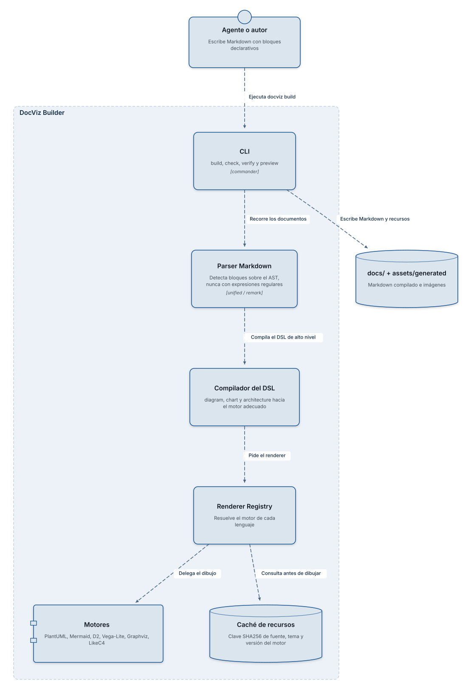
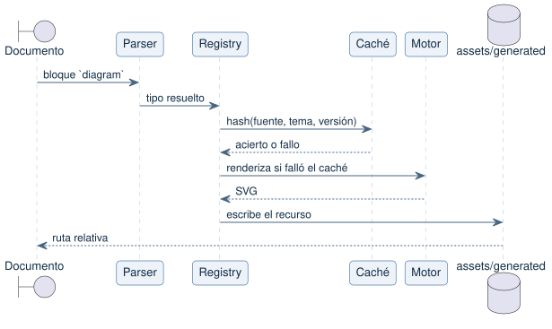
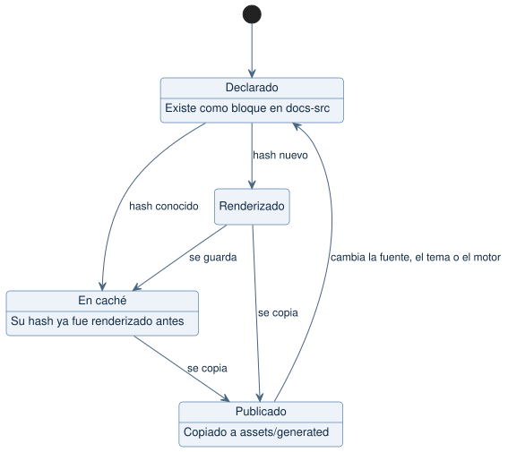
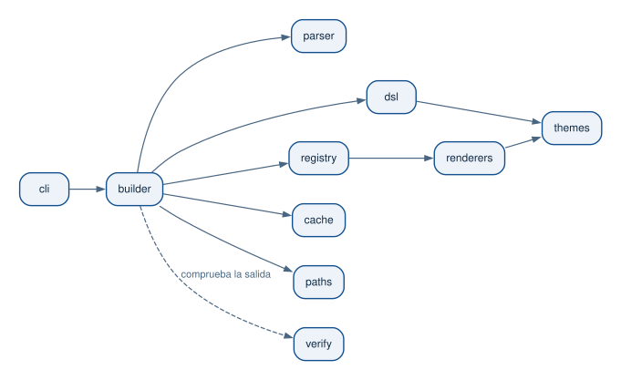

# Arquitectura de DocViz Builder

DocViz Builder convierte bloques declarativos escritos dentro de Markdown en
imágenes SVG, y reescribe el documento para que quede como **Markdown estándar y
portable**: quien lo lee no necesita saber que existieron PlantUML, Mermaid, D2,
Vega-Lite, Graphviz ni LikeC4.

## Capas

## Recorrido de un bloque

## Estados de un recurso

## Dependencias internas

## Decisiones de diseño

| Decisión | Motivo |
|---|---|
| Reemplazo por posición en lugar de reserializar | Reserializar con `remark-stringify` normalizaría viñetas, comillas y saltos; el criterio de aceptación exige mantener intacto el resto del Markdown |
| Motores locales por defecto | La documentación puede ser confidencial: nada sale del proceso salvo que se configure un Kroki propio |
| El hash incluye el tema y la versión del motor | Cambiar un color o actualizar PlantUML debe invalidar las imágenes afectadas, no todas |
| Emisor SVG propio para LikeC4 | La exportación oficial exige un navegador con Playwright; el emisor propio mantiene LikeC4 tan offline como el resto y respeta el tema |
| Identificadores del SVG renumerados | Vega mantiene un contador global por proceso: sin renumerar, el mismo gráfico produce bytes distintos y el caché deja de ser determinista |
