# El DSL de alto nivel

Un agente que escribe documentación no debería tener que recordar la sintaxis de
seis motores distintos. El DSL de DocViz reduce todo a tres vallas:

| Valla | Cuándo usarla |
|---|---|
| `diagram` | Interacción, flujo, estados, dependencias o análisis estratégico |
| `chart` | Comparación cuantitativa, tendencia o distribución |
| `architecture` | Modelo C4 de contexto, contenedores o componentes |

El autor declara **la intención**; DocViz elige el motor.

## Qué motor atiende cada intención



## Regla de elección

No todo merece un diagrama. La tabla de abajo es el criterio; cuando una tabla
Markdown comunica mejor, se usa la tabla.

| Necesidad | Tipo | Motor resultante |
|---|---|---|
| Quién habla con quién y en qué orden | `sequence` | PlantUML |
| Estructura de clases o entidades | `class` | PlantUML |
| Estados y transiciones | `state` | PlantUML |
| Decisiones dentro de un proceso | `activity` | PlantUML |
| Flujo sencillo de extremo a extremo | `flow` | Mermaid |
| Cronograma | `gantt` | Mermaid |
| Descomposición de un objetivo | `strategy-tree` | D2 |
| Causas de un problema | `issue-tree` | D2 |
| Capacidades por dominio | `capability-map` | D2 |
| Capas de un modelo operativo | `operating-model` | D2 |
| Cadena de valor | `value-chain` | D2 |
| Comparación de dos escenarios | `before-after` | D2 |
| Priorización en dos ejes | `matrix-2x2` | D2 |
| Fases en el tiempo | `roadmap` | D2 |
| Dependencias entre módulos | `dependency-map` | Graphviz |
| Comparación entre categorías | `bar` | Vega-Lite |
| Evolución temporal | `line` | Vega-Lite |
| Correlación | `scatter` | Vega-Lite |
| Densidad en dos dimensiones | `heatmap` | Vega-Lite |
| Descomposición de una variación | `waterfall` | Vega-Lite |
| Arquitectura C4 | `c4-context`, `c4-container` | LikeC4 |

## Ejemplo comentado

El bloque

````md
```diagram
type: sequence
title: Autenticación
participants:
  - Usuario
  - API
flow:
  - Usuario -> API: Login
  - API --> Usuario: Token
```
````

produce PlantUML con el tema del proyecto aplicado, lo renderiza a SVG y deja en
el documento compilado:

```md

```

La flecha `->` es un mensaje y `-->` una respuesta. Los participantes se
declaran una sola vez y se referencian por nombre; nombrar uno que no existe
detiene el build con un mensaje que dice cuáles hay.

## Prioridad del título

El texto alternativo de la imagen y el nombre del archivo salen, en este orden:

1. el atributo `title="..."` de la valla;
2. el campo `title:` del DSL;
3. el encabezado inmediatamente anterior;
4. un nombre genérico según el tipo.

## Vía de escape

Los lenguajes nativos siguen disponibles (`plantuml`, `mermaid`, `d2`,
`graphviz`, `vega-lite`, `likec4`) para lo que el DSL todavía no cubra. La
diferencia es que entonces el autor sí debe conocer ese lenguaje.
