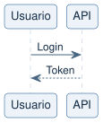
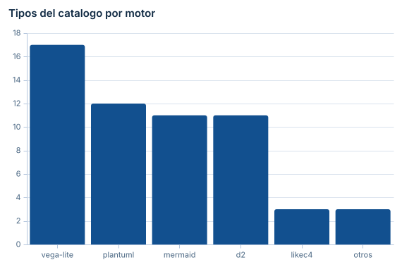
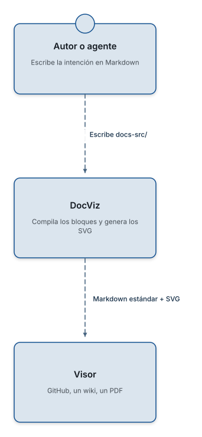

# DocViz

Escribes **qué quieres explicar**; DocViz elige el motor y devuelve Markdown
estándar con la imagen ya generada. El visor final no necesita conocer PlantUML,
Mermaid, D2, Vega-Lite, Graphviz ni LikeC4: solo saber mostrar una imagen.

```bash
npm install -D docviz-builder
npx docviz setup    # descarga plantuml.jar (única operación de red)
npx docviz init     # configuración, AGENTS.md y un ejemplo
```

## Se escribe así

````md
```diagram
type: sequence
title: Autenticación

participants:
  - Usuario
  - API

flow:
  - Usuario -> API: Login
  - API --> Usuario: Token
```
````

Y sale esto:



## 57 tipos, tres vallas

No hay que aprender seis sintaxis. Hay tres bloques y un catálogo que se
consulta desde la terminal:

```bash
npx docviz suggest "el proceso de aprobación de una solicitud"
npx docviz types             # los 57, con su propósito
npx docviz types sequence    # ficha y ejemplo que compila tal cual
```

| Valla | Cuándo |
|---|---|
| `diagram` | Interacción, flujo, estados, dependencias, análisis estratégico |
| `chart` | Comparación cuantitativa, tendencia, distribución |
| `architecture` | Modelo C4 |

## Lo mismo sirve para datos



## Y para arquitectura



## Todo ocurre en local

Los seis motores se ejecutan en la máquina: JVM para PlantUML, WebAssembly para
D2 y Graphviz, JavaScript en proceso para Vega-Lite, un Chromium local para
Mermaid y BPMN, y un emisor SVG propio para LikeC4. **El build no hace ninguna
petición de red.** La documentación que se procesa puede ser confidencial.

## Para agentes

```bash
npx docviz skill     # instala el contrato en el directorio de skills de tu agente
```

DocViz trae servidor MCP, un catálogo consultable, códigos de error estables y
un banco de casos que mide si un modelo sabe usarlo.

## Documentación

- [Arquitectura](./arquitectura.html) — cómo está construido por dentro
- [El DSL](./dsl.html) — los 57 tipos y su sintaxis
- [Seguridad](./seguridad.html) — qué garantiza y cómo se comprueba

El código está en [github.com/TilsonF/docviz-builder](https://github.com/TilsonF/docviz-builder).
