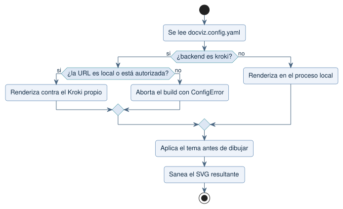

# Seguridad

DocViz procesa documentación técnica que puede ser confidencial y bloques
escritos por un modelo de lenguaje. Las dos cosas condicionan el diseño: nada
sale a la red por defecto, y ningún contenido del documento se interpreta como
ruta, comando o código ejecutable.

## Superficie de riesgo y control aplicado

| Riesgo | Control |
|---|---|
| Fuga de documentación a un servicio externo | Motores locales por defecto; `kroki.io` bloqueado salvo autorización explícita |
| Ejecución de shell desde el documento | Ningún renderer recibe una ruta del documento; PlantUML se alimenta por `stdin` |
| Lectura de archivos del disco | `!include`, `!includeurl` e `!import` de PlantUML están deshabilitados |
| Carga remota de datos | `data.url` de Vega-Lite se rechaza en cualquier nivel de la especificación |
| Escritura fuera del directorio de salida | Toda ruta pasa por `assertInside`; los nombres de archivo son slugs ASCII |
| Recorrido de directorios (`../../etc/passwd`) | Rechazado en configuración, en nombres de recurso y en el servidor de previsualización |
| SVG con scripts | Se eliminan `<script>`, manejadores `on*` y URLs `javascript:` |
| Diagrama que nunca termina | Límite de tiempo por render, configurable |
| Diagrama que agota la memoria | Límite de tamaño del recurso generado |
| Colisión de hash truncado | El build aborta si dos fuentes distintas comparten prefijo |

## Decisión sobre el backend

El camino por defecto es la rama de la derecha: sin configuración, DocViz no
abre ninguna conexión de red.

## Qué sí sale del proceso

Nada, salvo dos casos explícitos:

1. **Kroki self-hosted**, si se configura `renderers.backend: kroki` con una URL
   local o autorizada con `allowRemoteHost`.
2. **La descarga inicial de `plantuml.jar`** mediante `npm run setup`, que trae
   el motor desde Maven Central. Es una operación de instalación, no de
   compilación: después de ella el build funciona sin red.

## Verificación

Las barreras anteriores están cubiertas por pruebas automáticas: contención de
rutas, bloqueo de directivas de PlantUML, rechazo de `data.url`, saneado de SVG,
límites de tiempo y tamaño, y validación de la URL de Kroki.
