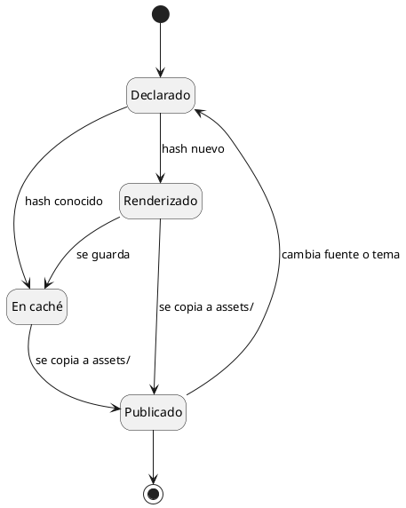

# DocViz Builder — showcase

Este documento existe para la validación manual: contiene al menos una
visualización de cada motor soportado, escritas tanto en el lenguaje nativo del
motor como en el DSL de alto nivel de DocViz.

Al compilarlo, **todos** los bloques de abajo deben convertirse en imágenes
Markdown estándar con rutas relativas. El documento resultante debe poder
moverse junto a su carpeta `assets/` sin perder ninguna imagen.

| Sección | Motor | Escrito en |
|---|---|---|
| Contexto del sistema | LikeC4 | DSL `architecture` |
| Contenedores | LikeC4 | LikeC4 nativo |
| Autenticación | PlantUML | DSL `diagram` |
| Modelo de dominio | PlantUML | DSL `diagram` |
| Ciclo de vida | PlantUML | PlantUML nativo |
| Publicación de documentación | Mermaid | DSL `diagram` |
| Plan de entregas | Mermaid | DSL `diagram` |
| Estrategia de calidad | D2 | DSL `diagram` |
| Mapa de capacidades | D2 | DSL `diagram` |
| Defectos por sprint | Vega-Lite | DSL `chart` |
| Cobertura por disciplina | Vega-Lite | DSL `chart` |
| Dependencias entre módulos | Graphviz | DSL `diagram` |

---

## 1. C4 — Contexto del sistema

Quién usa la plataforma y con qué sistemas habla. Escrito con el DSL
`architecture`: el autor no elige tecnología.

```architecture
type: c4-context
title: Contexto de la plataforma de documentación

elements:
  - id: autor
    kind: person
    name: Autor
    description: Escribe documentación asistido por un agente

  - id: agente
    kind: system
    name: Agente de IA
    description: Genera contenido y bloques declarativos

  - id: docviz
    kind: system
    name: DocViz Builder
    description: Compila los bloques a SVG y produce Markdown portable
    color: primary

  - id: portal
    kind: browser
    name: Portal de documentación
    description: Publica el Markdown compilado

relations:
  - from: autor
    to: agente
    label: Pide documentación
  - from: agente
    to: docviz
    label: Escribe bloques declarativos
  - from: docviz
    to: portal
    label: Publica Markdown + assets
```

---

## 2. C4 — Contenedores

El mismo modelo un nivel más abajo, esta vez escrito directamente en LikeC4
para mostrar que el lenguaje nativo sigue disponible.

```likec4 title="Contenedores de DocViz"
specification {
  element system {
    style {
      size sm
    }
  }
  element container {
    style {
      size sm
    }
  }
  element store {
    style {
      shape cylinder
      size sm
    }
  }
}

model {
  docviz = system 'DocViz Builder' {

    cli = container 'CLI' {
      description 'docviz build / check / verify'
      technology 'Node.js'
    }

    parser = container 'Parser Markdown' {
      description 'Detecta bloques sobre el AST'
      technology 'unified / remark'
    }

    registry = container 'Renderer Registry' {
      description 'Resuelve el motor de cada lenguaje'
    }

    cache = store 'Caché de recursos' {
      description 'SHA256 del contenido'
    }

    cli -> parser 'Recorre los documentos'
    parser -> registry 'Pide el renderer'
    registry -> cache 'Consulta antes de dibujar'
  }
}

views {
  // `of docviz` acota la vista al interior del sistema: sin ese alcance
  // LikeC4 solo dibujaria la caja exterior.
  view index of docviz {
    title 'Contenedores de DocViz'
    include *
  }
}
```

---

## 3. UML Sequence — Autenticación

```diagram
type: sequence
title: Autenticación de usuario

participants:
  - name: Usuario
    type: actor
  - Frontend
  - Entra ID
  - API

flow:
  - Usuario -> Frontend: Login
  - Frontend -> Entra ID: Authenticate
  - Entra ID --> Frontend: Token
  - Frontend -> API: Request + Token
  - API --> Frontend: 200 OK
  - note: El token se valida en cada petición
    over: API
```

---

## 4. UML Class — Modelo de dominio

```diagram
type: class
title: Modelo de dominio de DocViz

classes:
  - name: Documento
    attributes:
      - ruta
      - contenido
    methods:
      - compilar

  - name: Bloque
    attributes:
      - lenguaje
      - fuente
      - titulo

  - name: Renderer
    interface: true
    methods:
      - render
      - version

  - name: Recurso
    attributes:
      - hash
      - formato

relations:
  - from: Documento
    to: Bloque
    type: composition
    label: contiene

  - from: Bloque
    to: Renderer
    type: dependency
    label: se resuelve con

  - from: Renderer
    to: Recurso
    type: dependency
    label: produce
```

---

## 5. UML State — Ciclo de vida de un recurso

Escrito en PlantUML nativo.



---

## 6. Mermaid Flowchart — Publicación de documentación

```diagram
type: flow
title: Flujo de publicación de documentación
direction: lr

nodes:
  - name: Revisión humana
    shape: decision

flow:
  - Agente -> docs-src: Escribe bloques
  - docs-src -> docviz check: Valida
  - docviz check -> docviz build: Compila
  - docviz build -> docs: Markdown + assets
  - docs -> Revisión humana
  - Revisión humana -> Portal: Aprobada
  - Revisión humana --> docs-src: Con observaciones
```

---

## 7. Mermaid Gantt — Plan de entregas

```diagram
type: gantt
title: Plan de adopción de DocViz
axisFormat: "%d/%m"

sections:
  - name: Preparación
    tasks:
      - name: Despliegue del compilador
        start: 2026-01-05
        duration: 5d
        status: done
      - name: Migración de documentos
        after: Despliegue del compilador
        duration: 10d
        status: active

  - name: Adopción
    tasks:
      - name: Formación a equipos
        start: 2026-01-26
        duration: 8d
      - name: Documentación al día
        start: 2026-02-05
        status: milestone
```

---

## 8. D2 Strategy Tree — Estrategia de calidad

```diagram
type: strategy-tree
title: Estrategia de reducción de defectos

root: Reducir defectos en producción

branches:
  - name: Calidad
    children:
      - Automatización de pruebas
      - Code review
  - name: Proceso
    children:
      - Refinamiento
      - Definition of Done
  - name: Arquitectura
    children:
      - Análisis estático
      - Observabilidad
```

---

## 9. D2 Capability Map — Mapa de capacidades

```diagram
type: capability-map
title: Capacidades de la fábrica de software

domains:
  - name: Ingeniería
    capabilities:
      - Desarrollo
      - Revisión
      - Automatización

  - name: Calidad
    capabilities:
      - Pruebas funcionales
      - Pruebas de carga
      - Gestión de defectos

  - name: Operación
    capabilities:
      - Despliegue
      - Monitoreo
```

---

## 10. Vega-Lite Bar Chart — Defectos por sprint

```chart
type: bar
title: Defectos por sprint
xTitle: Sprint
yTitle: Defectos
showValues: true

data:
  - label: SP1
    value: 42
  - label: SP2
    value: 31
  - label: SP3
    value: 18
  - label: SP4
    value: 12
  - label: SP5
    value: 9
```

---

## 11. Vega-Lite Line Chart — Cobertura por disciplina

```chart
type: line
title: Evolución de la cobertura de pruebas
xTitle: Sprint
yTitle: Cobertura (%)

series:
  - name: Backend
    data:
      - label: SP1
        value: 41
      - label: SP2
        value: 55
      - label: SP3
        value: 68
      - label: SP4
        value: 74
      - label: SP5
        value: 81

  - name: Frontend
    data:
      - label: SP1
        value: 22
      - label: SP2
        value: 30
      - label: SP3
        value: 45
      - label: SP4
        value: 58
      - label: SP5
        value: 66
```

---

## 12. Graphviz — Dependencias entre módulos

```diagram
type: dependency-map
title: Dependencias internas de DocViz
direction: lr

dependencies:
  - cli -> builder
  - builder -> parser
  - builder -> registry
  - builder -> cache
  - registry -> plantuml
  - registry -> mermaid
  - registry -> d2
  - registry -> graphviz
  - registry -> vega-lite
  - registry -> likec4
  - builder --> themes: aplica
```

---

## Lo que no se toca

Los bloques de código que no son visualizaciones se conservan tal cual:

```typescript
export interface DiagramRenderer {
  readonly type: string;
  render(source: string, options: RenderOptions): Promise<RenderResult>;
}
```

```bash
npm run docs:check && npm run docs:build && npm run docs:test
```

```json
{ "formats": { "plantuml": "svg", "likec4": "svg" } }
```

Y el Markdown normal —listas, tablas, énfasis, enlaces— llega intacto al
documento compilado.
